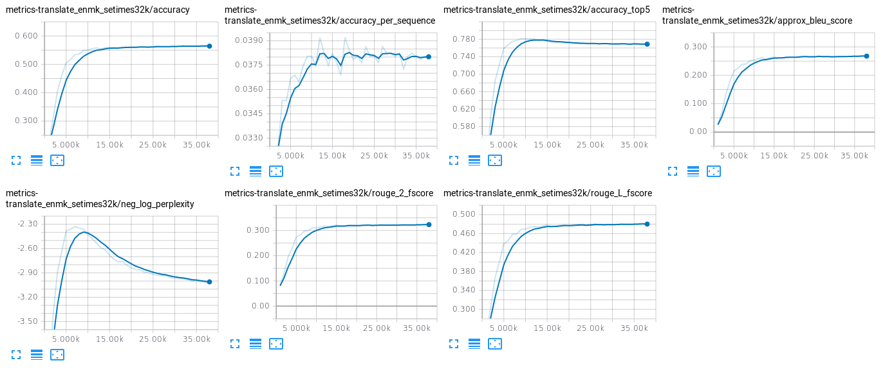

# Neural Machine Translation system for English to Macedonian

This repository contains all data and documentation for building a neural
machine translation system for English <-> Macedonian.

# Dataset

The [*SETimes corpus*](http://nlp.ffzg.hr/resources/corpora/setimes/) contains
of 207,777 parallel sentences for the Macedonian and English language pair. The
complete corpus is used as training set.

For development and test set the MULTEXT-East "1984" from [here](https://www.clarin.si/repository/xmlui/handle/11356/1043)
is used. The English and Macedonian translations were aligned. The resulting
source and target translations are split into development and test set and
"detokenized" using the [detokenizer.perl](https://github.com/moses-smt/mosesdecoder/blob/master/scripts/tokenizer/detokenizer.perl)
script from Moses.

The following table shows an overview of available sentences:

| Data set    | Sentences | Download
| ----------- | --------- | -------------------------------------------------------------------------------------------------------------------------------------
| Training    | 205,777   | via [GitHub](http://nlp.ffzg.hr/data/corpora/setimes/setimes.en-mk.txt.tgz)
| Development |   4,986   | via [GitHub](https://github.com/stefan-it/nmt-en-mk/raw/master/data/MTE-1984-dev.enmk.tgz) or located in `data/MTE-1984-dev.enmk.tgz`
| Test        |   2,000   | via [GitHub](https://github.com/stefan-it/nmt-en-mk/raw/master/data/MTE-1984-test.enmk.tgz) or located in `MTE-1984-test.enmk.tgz`

# *tensor2tensor* - Transformer

Another NMT system for English-Estonian is built with the
[*tensor2tensor*](https://github.com/tensorflow/tensor2tensor) library.

## Preparation

In the first step, all necessary folders needs to be created:

```bash
mkdir -p t2t_data t2t_datagen t2t_train t2t_output
```

## Data generation

In the next step, the training and development sets are downloaded and the
vocabulary is generated:

```bash
t2t-datagen --data_dir=t2t_data --tmp_dir=t2t_datagen/ --problem=translate_enmk_setimes32k
```

## Training

Now the training can be started:

```bash
t2t-trainer --data_dir=t2t_data --problems=translate_enmk_setimes32k_rev \
  --model=transformer --hparams_set=transformer_base --output_dir=t2t_output
  --worker_gpu 8
```

The number of used GPUs during training can be specified with the `--worker_gpu`
commandline option.

## Decoding

The test set must be downloaded and extracted for decoding:

```bash
wget https://github.com/stefan-it/nmt-en-mk/raw/master/data/MTE-1984-test.enmk.tgz
tar -xzf MTE-1984-test.enmk.tgz
```

Then the decoding can be started with:

```bash
t2t-decoder --data_dir=t2t_data --problems=translate_enmk_setimes32k \
  --model=transformer --decode_hparams="beam_size=4,alpha=0.6" \
  --decode_from_file=MTE1984-test.en --decode_to_file=system.output \
  --hparams_set=transformer_base --output_dir=/tmp/t2t_output/
```

The decoded test set is then written to `system.output`.

## Calculating the BLEU-score

The BLEU-score can be calculated with the `t2t-bleu` tool:

```bash
t2t-bleu --translation=system.output --reference=MTE1984-test.mk
```

# Results

A English to Macedonian NMT system was trained for 38,000 steps on a *DGX-1*
with 8 NVIDIA P100 GPUs.

The following figure shows some nice *TensorBoard* graphs:



The obtained BLEU-scores on the final test set are:

| BLEU-score | Option
| ---------- | ------
| 13.76      | uncased
| 13.31      | cased

# Acknowledgments

We would like to thank the *Leibniz-Rechenzentrum der Bayerischen Akademie der
Wissenschaften* ([LRZ](https://www.lrz.de/english/)) for giving us access to the
NVIDIA *DGX-1* supercomputer.
